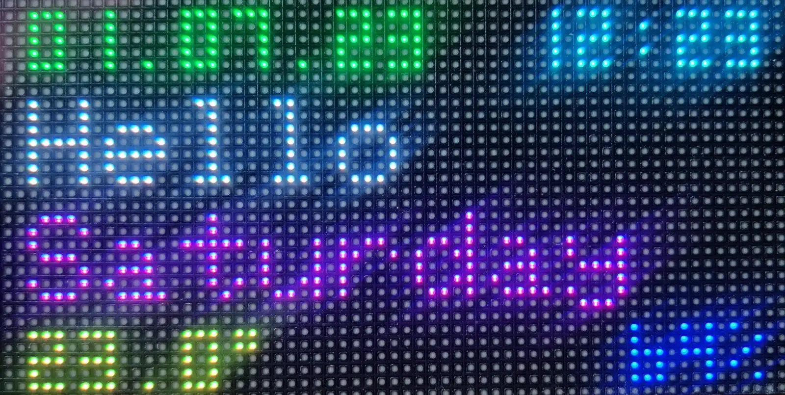

# Introduction
Display date and time and temperature on a 64x32 Pixel display.




# Hardware
* ESP32 NodeMCU Module WLAN WiFi Dev Kit C Development Board with CP2102
* RGB Full-Color LED Matrix Panel Display, 64×32 Pixel
* ME680 Digital Temperature Humidity Pressure Sensor CJMCU-680
* Some wires

How the pins are connected to the ESP32 is listed in the ```.ino``` file. 

# Development
Arduino IDE can be used to compile and upload the source code.

Select "ESP32 Dev Module" as board.

